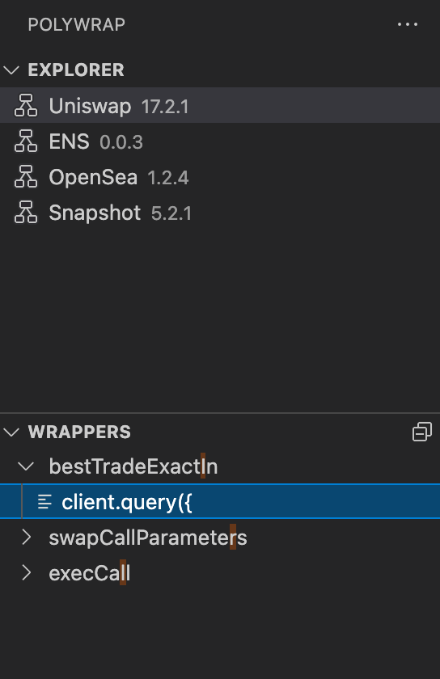

# polywrap-vscode ✨

Closing the development loop between Polywrap wrappers and the IDE.

## Installation

Head to the VSCode Extension [Marketplace](https://marketplace.visualstudio.com/vscode) or search the extensions from within VSCode itself.

## Screenshot

## Contact

Get in [touch](https://github.com/kevinbluer).